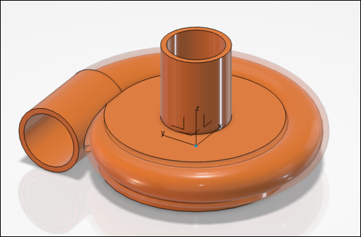
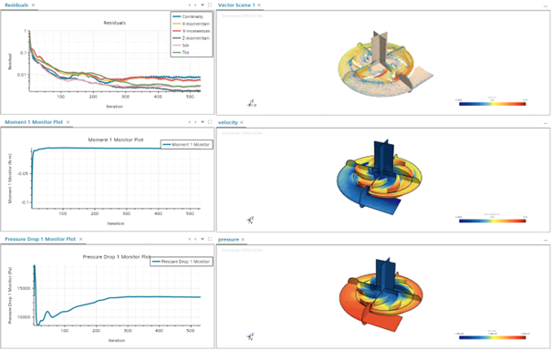
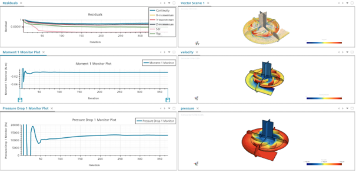

# Centrifugal Pump Design for Biomedical Applications  
*System Design · CFD Analysis · Prototyping*

This repository presents the design, simulation, and validation of a
centrifugal pump developed for **biomedical fluid transport applications**,
with a focus on efficiency, flow uniformity, and operating conditions relevant
to heart failure support devices.

The project combines system-level design, CFD analysis, and rapid prototyping,
and was carried out in an academic engineering context.

## Project objective

The objective of this project was to design a centrifugal pump capable of
delivering the required flow rate and pressure rise while maintaining high
hydraulic efficiency and smooth internal flow structures suitable for
biomedical use.

## Design methodology

- Definition of target operating conditions (flow rate, pressure rise)
- Python-based preliminary sizing of the impeller
- Detailed CAD modeling of the impeller and housing in **CATIA V5**
- Assembly-level integration of inlet and outlet flow paths

- 

  
  

  <em>CAD models of the centrifugal pump assembly and impeller designed in CATIA V5.</em>

The geometry was iteratively refined to improve flow guidance and reduce losses.

## CFD analysis

The hydraulic performance of the pump was assessed using **STAR-CCM+**:

- Three-dimensional RANS simulations
- Analysis of velocity and pressure fields inside the pump
- Evaluation of flow uniformity and recirculation zones
- Estimation of hydraulic efficiency

CFD results were used to guide design iterations and converge toward an
efficient operating configuration.

  
  

  <em>CFD results from STAR-CCM+ simulations for water (left) and blood (right),
used to assess flow structures and hydraulic performance.</em>

## Prototyping and validation

A scaled prototype of the pump (impeller and housing) was manufactured using
**FDM 3D printing (PLA)** to enable rapid physical validation.

The final design achieved an estimated hydraulic efficiency of approximately
**80%**, consistent with CFD predictions, demonstrating good agreement between
numerical analysis and physical realization.

## Engineering insights

This project highlights the importance of coupling system-level design,
three-dimensional CFD analysis, and prototyping when developing rotating
machinery for constrained applications. The workflow illustrates how CFD can
be used as a design tool rather than a post-processing step.

## Technical stack

- Python (preliminary sizing and analysis)
- CATIA V5 (CAD design)
- STAR-CCM+ (CFD simulations)
- FDM 3D printing (prototype manufacturing)

🔒 Design scripts and CFD setups are not publicly available.
